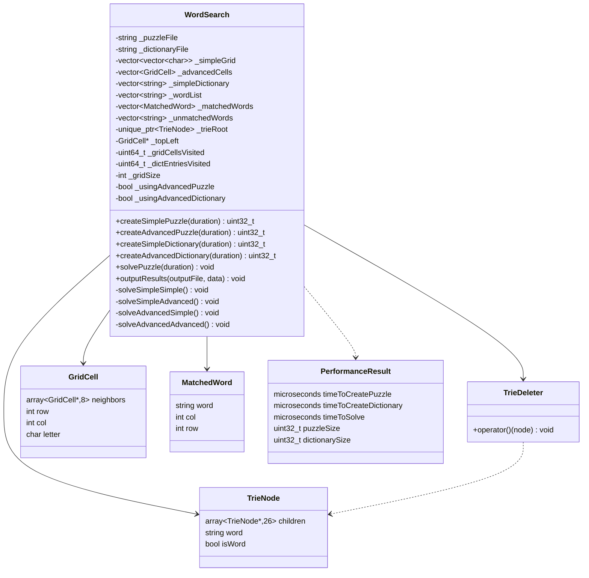

# WordSearch Puzzle Solver — Final Lab

A C++ investigation into alternative data structures for solving WordSearch puzzles. Four combinations of grid and dictionary representations are benchmarked against each other, measuring solve time, memory usage, and visit counts.

---

## Building

No third-party libraries are used — only the C++ standard library.
1. Open the solution in Visual Studio 2022
2. Select the **Release** build configuration (required for accurate performance timing)
3. Build and run
---

## Parasoft


---

## Data Structures

### Grid Representations

**Simple Puzzle — `std::vector<std::vector<char>>`**

The grid is stored as a 2D vector, giving direct row/column access. Neighbour positions are recalculated at traversal time. Simple to implement and cache-friendly for row-wise access, but involves repeated boundary checking and index arithmetic during solving.

**Advanced Puzzle — `std::vector<GridCell>` (graph)**

The grid is stored as a flat vector of `GridCell` structs. Each cell holds its letter, coordinates, and **an array of 8 non-owning pointers to its neighbours**, precomputed at construction. Traversal follows these pointers directly with no index arithmetic. This reduces per-step compute cost during solving at the expense of higher memory usage per cell.

```cpp
struct GridCell
{
    // Members ordered largest → smallest for optimal memory alignment
    std::array<GridCell*, 8> neighbors{};   // 64 bytes
    int row = 0;                            //  4 bytes
    int col = 0;                            //  4 bytes
    char letter = '\0';                     //  1 byte  (+3 bytes padding)
};
```

> Members are ordered `pointer array → int → int → char` for optimal memory alignment, minimising internal padding.

---

### Dictionary Representations

**Simple Dictionary — `std::vector<std::string>`**

Words are stored in a flat vector and searched sequentially. No prefix pruning is possible — every candidate sequence must be checked against the full list.

**Advanced Dictionary — Trie (`std::unique_ptr<TrieNode, TrieDeleter>`)**

A Trie (prefix tree) where each node covers one character and holds up to 26 child pointers. Words are inserted character by character; terminal nodes are marked with `isWord = true` and store the complete word string. During solving, traversal can be **abandoned early** the moment no valid prefix exists — significantly cutting the search space.

```cpp
struct TrieNode
{
    // Members ordered largest → smallest for optimal memory alignment
    std::array<TrieNode*, 26> children{};   // 208 bytes
    std::string word;                       //  32 bytes
    bool isWord = false;                    //   1 byte  (+7 bytes padding)
};
```

> The Trie root is heap-allocated and **owned** by `WordSearch` via `std::unique_ptr<TrieNode, TrieDeleter>`. `TrieDeleter` is a named functor that recursively deletes all nodes; it is invoked automatically when the `unique_ptr` goes out of scope, with no manual destructor code required.

---

## The Four Solver Configurations

| # | Grid | Dictionary | Output File | Solver Method |
|---|------|------------|-------------|---------------|
| 1 | Simple | Simple | `simple_puzzle_simple_dictionary.txt` | `solveSimpleSimple()` |
| 2 | Advanced | Simple | `advanced_puzzle_simple_dictionary.txt` | `solveAdvancedSimple()` |
| 3 | Simple | Advanced | `simple_puzzle_advanced_dictionary.txt` | `solveSimpleAdvanced()` |
| 4 | Advanced | Advanced | `advanced_puzzle_advanced_dictionary.txt` | `solveAdvancedAdvanced()` |

`solvePuzzle()` dispatches to the correct private method based on the `_usingAdvancedPuzzle` and `_usingAdvancedDictionary` flags, which are set when the respective `create*` methods are called.

---

## Class Reference

### `PerformanceResult`

Plain struct used to pass timing and memory data from `WordSearch` back to `main`. Members are ordered largest → smallest to minimise padding.

| Field | Type | Description |
|---|---|---|
| `timeToCreatePuzzle` | `std::chrono::microseconds` | Grid population time |
| `timeToCreateDictionary` | `std::chrono::microseconds` | Dictionary population time |
| `timeToSolve` | `std::chrono::microseconds` | Puzzle solving time |
| `puzzleSize` | `uint32_t` | Byte size of the grid data structure |
| `dictionarySize` | `uint32_t` | Byte size of the dictionary data structure |

---

### `WordSearch`

Declared `final` because its destructor is non-virtual. Follows the **Rule of 5**:

- Copy constructor and copy assignment are **deleted** (owns heap memory via `_trieRoot`)
- Move constructor and move assignment are **defaulted**
- Destructor is **defaulted** — `std::unique_ptr<TrieNode, TrieDeleter>` handles all Trie cleanup automatically

#### Public Methods

| Method | Returns | Description |
|---|---|---|
| `WordSearch(puzzleFile, dictionaryFile)` | — | Constructor; stores file paths |
| `createSimplePuzzle(duration)` | `uint32_t` | Populates `_simpleGrid`; sets `_usingAdvancedPuzzle = false` |
| `createAdvancedPuzzle(duration)` | `uint32_t` | Populates `_advancedCells` and links neighbour pointers; sets `_usingAdvancedPuzzle = true` |
| `createSimpleDictionary(duration)` | `uint32_t` | Populates `_simpleDictionary`; sets `_usingAdvancedDictionary = false` |
| `createAdvancedDictionary(duration)` | `uint32_t` | Builds Trie from `_wordList`; sets `_usingAdvancedDictionary = true` |
| `solvePuzzle(duration)` | `void` | Dispatches to the correct private solver; populates `_matchedWords`, `_unmatchedWords`, and visit counters |
| `outputResults(outputFile, data)` | `void` | Writes results to the named file in the required format |

#### Private Members

Members are grouped and ordered by size (largest → smallest) to minimise struct padding.

| Member | Type | Size | Description |
|---|---|---|---|
| `_puzzleFile` | `const std::string` | 32B | Path to puzzle input |
| `_dictionaryFile` | `const std::string` | 32B | Path to dictionary input |
| `_simpleGrid` | `vector<vector<char>>` | 24B | Simple 2D grid |
| `_advancedCells` | `vector<GridCell>` | 24B | Flat graph of cells with neighbour pointers |
| `_simpleDictionary` | `vector<string>` | 24B | Flat word list |
| `_wordList` | `vector<string>` | 24B | Master word list (used by both dictionary builders) |
| `_matchedWords` | `vector<MatchedWord>` | 24B | Words found in the grid |
| `_unmatchedWords` | `vector<string>` | 24B | Words not found |
| `_trieRoot` | `unique_ptr<TrieNode, TrieDeleter>` | 8B | Owning pointer to Trie root |
| `_topLeft` | `GridCell*` | 8B | Non-owning pointer to cell at (0,0) in the advanced grid |
| `_gridCellsVisited` | `uint64_t` | 8B | Total grid cell visits during solve |
| `_dictEntriesVisited` | `uint64_t` | 8B | Total dictionary node/entry visits during solve |
| `_gridSize` | `int` | 4B | Side length of the square grid |
| `_usingAdvancedPuzzle` | `bool` | 1B | Dispatch flag for `solvePuzzle()` |
| `_usingAdvancedDictionary` | `bool` | 1B | Dispatch flag for `solvePuzzle()` |

---

## UML Class Diagram



---

## Design
**Data Structures, Organisation and Operation**

This program implements two grid representations and two dictionary representations, combined into four solver configurations.
Simple Grid (std::vector<std::vector<char>>) stores the puzzle as a 2D vector of characters. It is populated row by row from the input file. During solving, a pair of nested loops iterates over every (row, col) starting position; for each of the 8 compass directions a further loop steps through the grid using index arithmetic (r + k * DR, c + k * DC), performing a bounds check at every step. The structure is straightforward and cache-friendly for row-wise access, but the repeated index arithmetic and bounds checking add overhead per character comparison.
Advanced Grid (std::vector<GridCell>) stores the puzzle as a flat vector of GridCell objects. Each cell records its letter, row, and column, and holds an array of 8 non-owning pointers to its neighbours, computed once at construction time. During solving, traversal follows these pre-linked pointers directly no arithmetic, no bounds checking per step. The _topLeft pointer provides a fixed entry point, with row traversal going south via neighbors[4] and column traversal going east via neighbors[2]. The trade-off is significantly higher memory per cell (a 64-byte pointer array vs. one byte for the simple grid).
Simple Dictionary (std::vector<std::string>) stores all words in a flat sequential list. Searching iterates the entire list for every candidate sequence; there is no mechanism to prune the search early. It is very cheap to construct but expensive to search repeatedly.
Advanced Dictionary (Trie via std::unique_ptr<TrieNode, TrieDeleter>) stores words as a prefix tree. Each TrieNode holds up to 26 child pointers (one per letter A–Z), a flag marking word terminals, and the full word string at terminals. Insertion walks or creates nodes character by character. During solving, traversal descends one node per letter; if no child exists for the current letter, the entire subtree is abandoned immediately. This prefix pruning means large portions of the search space are discarded without examining every word individually.

**Critique of the Design**
**Merits**
The grid and dictionary are completely decoupled, either can be swapped independently, which is what makes the four-configuration benchmark possible. Each configuration has its own dedicated solver method, so every code path is isolated, easy to read, and straightforward to profile. Memory ownership is explicit: the WordSearch class owns the Trie via std::unique_ptr<TrieNode, TrieDeleter>, and all GridCell neighbour pointers are non-owning raw pointers into the stable flat vector, making ownership semantics clear. All structs and class members are ordered largest-to-smallest to minimise padding, and WordSearch is declared final to prevent unsafe inheritance from a class with a non-virtual destructor.
**Weaknesses**
The four solver methods (solveSimpleSimple, solveSimpleAdvanced, solveAdvancedSimple, solveAdvancedAdvanced) each implement their own traversal loop, leading to significant code duplication that would be difficult to maintain or extend. Storing a complete std::string at every Trie terminal node is memory-inefficient. A word index into _wordList would achieve the same result at a fraction of the cost. The duplicate-detection sets inside each solver use std::set<std::string>, which has O(log n) lookup; std::unordered_set would give O(1) average case. Finally, the advanced grid's 8 pointer-sized neighbours per cell (64 bytes) means each cell is much larger than a character, which can increase cache pressure on large grids.
What Would You Change ?
The most impactful change would be replacing the four duplicated solver methods with a strategy pattern. An abstract traversal interface with concrete implementations injected at runtime. This would reduce the codebase considerably and make adding new grid or dictionary types a matter of writing a single new class rather than touching the existing switch logic. The full std::string in each TrieNode would be replaced with a uint32_t index into _wordList, and std::set would be replaced with std::unordered_set throughout. Both changes reduce memory and improve lookup time at negligible implementation cost.

## Performance Analysis
Comparison Across the Four Configurations

The four configurations differ in both how the grid is traversed and how words are looked up, and these differences compound each other in measurable ways.

Configuration 1 - Simple Grid + Simple Dictionary (solveSimpleSimple)
This is the baseline. For each word in the dictionary the solver visits every (row, col, direction) triple in the grid, performing index arithmetic and bounds checking at every step. Both the grid traversal and the dictionary lookup scale poorly: grid cells visited is O(W × N² × 8 × L) where W is the word count, N is the grid side length, and L is the average word length. Dictionary entries visited matches W directly since every word is tested from every starting position. This combination is expected to produce the highest cell visit count and the longest solve time.

Configuration 2 - Advanced Grid + Simple Dictionary (solveAdvancedSimple)
Replacing the simple grid with the linked GridCell structure eliminates index arithmetic and bounds checking during traversal - pointer following replaces both. Grid cell visits are the same in count but cheaper per visit. However, the dictionary lookup is unchanged; every word still drives an exhaustive search across all starting cells. The reduction in per-step compute cost should be visible in the solve time, but the overall algorithmic complexity is the same as Configuration 1. The construction time for the advanced grid is higher because neighbour pointers must be linked.

Configuration 3 - Simple Grid + Advanced Dictionary (solveSimpleAdvanced)
This is the more architecturally significant change. Instead of selecting words from the dictionary and searching the grid for each, the solver now visits every (row, col, direction) triple once and walks the Trie simultaneously. The moment no valid prefix child exists, that direction is abandoned. This dramatically reduces dictionary entries visited because common prefixes are only evaluated once rather than once per word that shares them. Grid cell visits also decrease because short-circuit exit stops traversal early. Solve time is expected to be substantially lower than Configurations 1 and 2 despite the simple grid's arithmetic overhead.

Configuration 4 - Advanced Grid + Advanced Dictionary (solveAdvancedAdvanced)
This combines the pointer-following traversal of the advanced grid with the prefix-pruning Trie lookup. It is expected to be the fastest configuration: traversal is cheap (no arithmetic or bounds checks), and prefix pruning minimises both grid cell visits and dictionary entries visited. The construction overhead is highest here (both the neighbour-linking pass and the Trie insertion), but this cost is paid once and amortised across the solve.

Dictionary-first vs. Grid-first Traversal
The two fundamental algorithmic strategies differ in which structure drives the outer loop.
In dictionary-first traversal (Configurations 1 and 2), each word is selected from the dictionary and then searched for exhaustively across the grid. This means every word causes a full O(N² × 8) scan, regardless of whether that word could possibly appear. With a large dictionary and a small grid, most of this work is wasted. The simple dictionary amplifies this because every word must be individually driven through the outer loop - there is no shared prefix work.

In grid-first traversal (Configurations 3 and 4), each grid position drives the outer loop and the dictionary structure is consulted incrementally as letters are read. The Trie is the key enabler: it allows the dictionary to be queried one letter at a time and returns a definitive "no match possible" the moment the current letter sequence diverges from all dictionary words. This collapses the search space significantly. The effect is strongest when the dictionary contains many words with common prefixes, because those prefixes are evaluated only once per grid traversal rather than once per word.
The choice of data structure strongly influences which strategy is available. The simple vector dictionary cannot support grid-first traversal efficiently - there is no mechanism to query "does any word continue with letter X from this prefix?" without scanning the entire list. The Trie provides exactly this interface at O(1) per letter via its child pointer array. Conversely, the advanced grid's pointer-following traversal is a natural fit for grid-first strategies because following a neighbour pointer is the same operation regardless of direction, making the inner loop uniform and branch-prediction friendly. The combination of advanced grid and advanced dictionary (Configuration 4) therefore represents both the lowest visit counts and the lowest per-visit cost.

## Design Notes

**Strengths**
- Clear separation of concerns — grid and dictionary structures are fully independent
- Four explicit solver methods make each code path easy to profile and reason about
- Rule of 5 correctly applied; Trie memory is safely reclaimed automatically via `std::unique_ptr<TrieNode, TrieDeleter>`
- All structs and class members ordered largest → smallest for optimal memory alignment, minimising padding
- `WordSearch` declared `final` to prevent unsafe inheritance from a non-virtual destructor
- `TrieDeleter` as a named functor makes Trie ownership unambiguous to both humans and static-analysis tools

**Weaknesses / Known Limitations**
- Four separate solver methods duplicate traversal logic; a strategy pattern would be more maintainable
- Storing a full `std::string word` at each Trie terminal node uses more memory than necessary
- The advanced grid's 8 neighbour pointers per cell can hurt CPU cache performance on large grids

**Potential Improvements**
- Introduce a solver strategy interface to eliminate duplicated traversal code
- Store only a word index (into `_wordList`) at Trie terminals rather than the full string
- Replace `std::set<std::string>` duplicate-detection in solvers with `std::unordered_set` for O(1) average lookup
